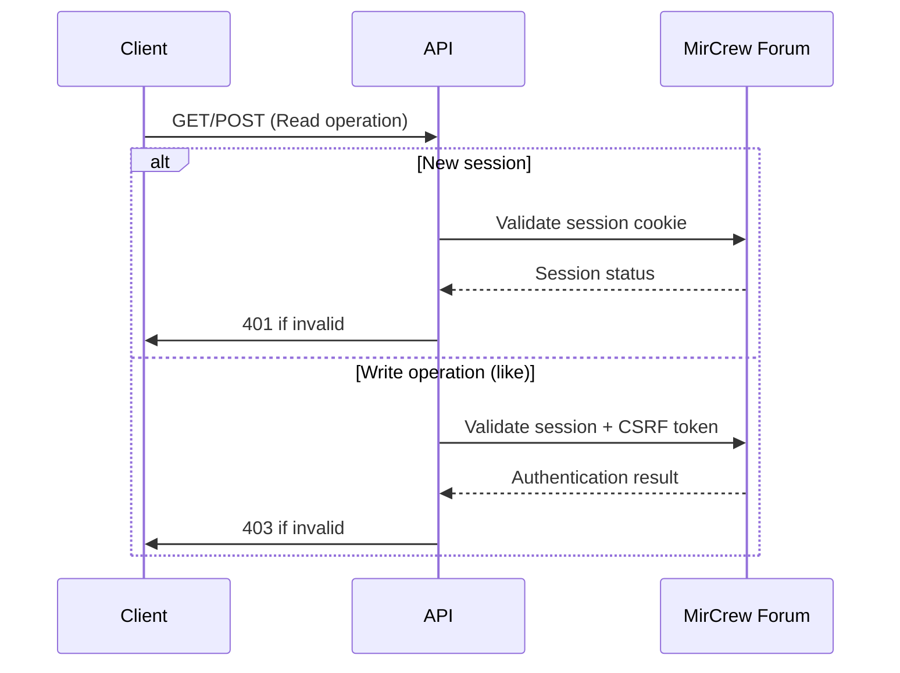
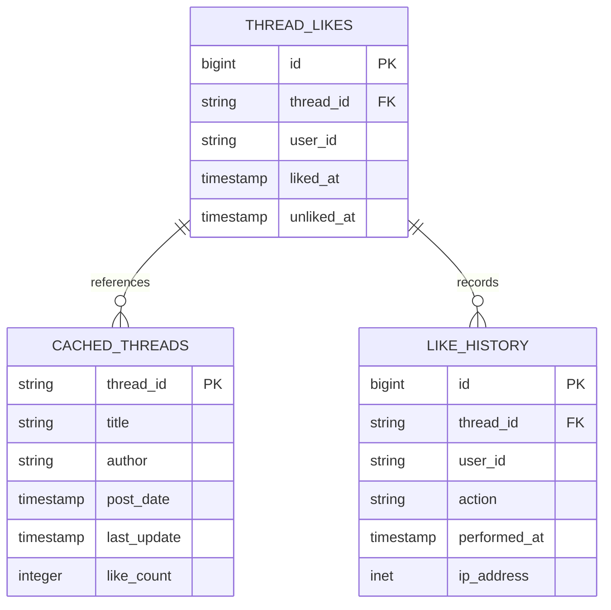
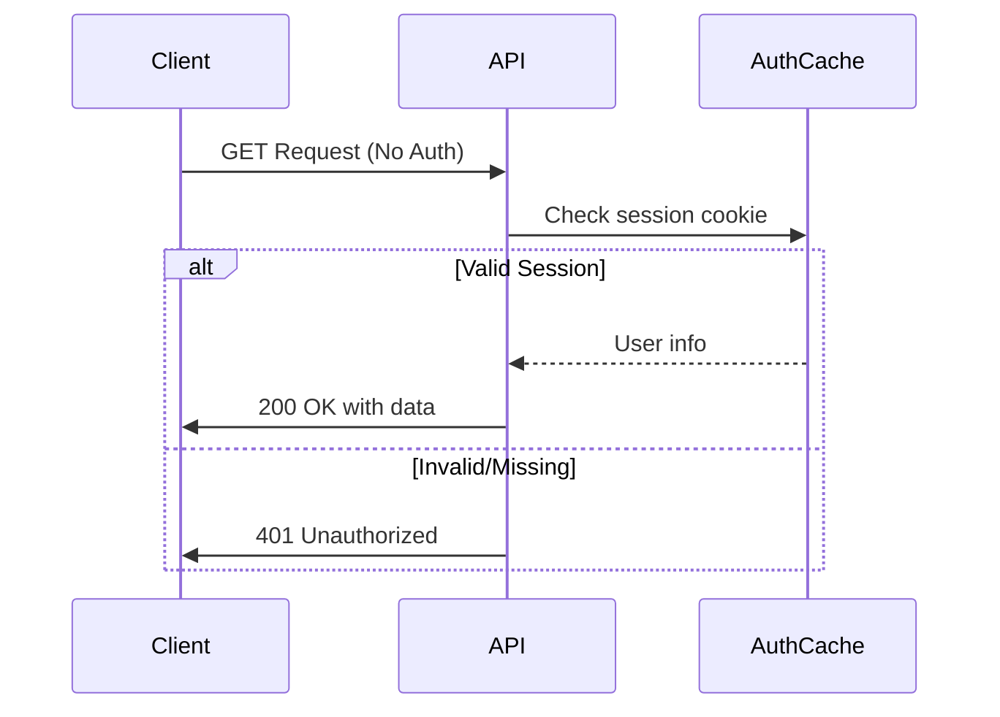
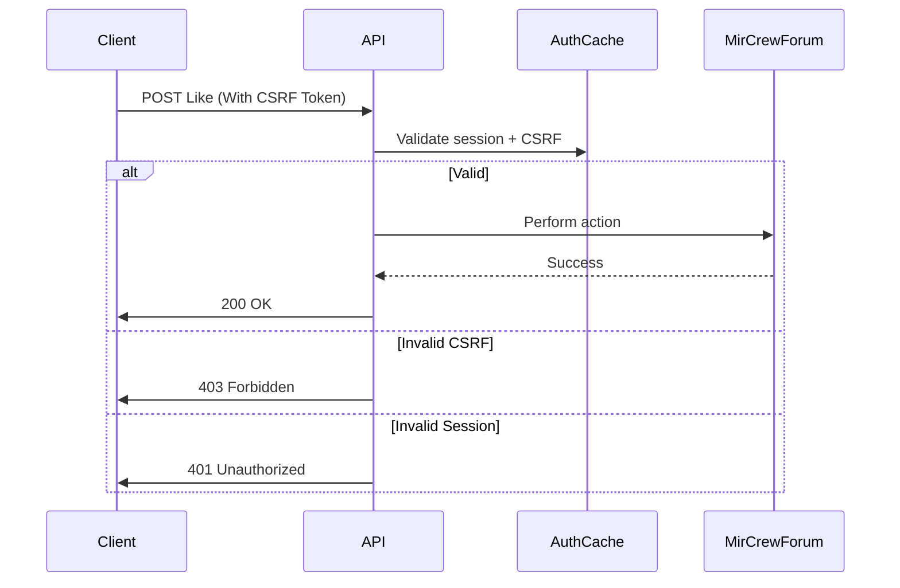
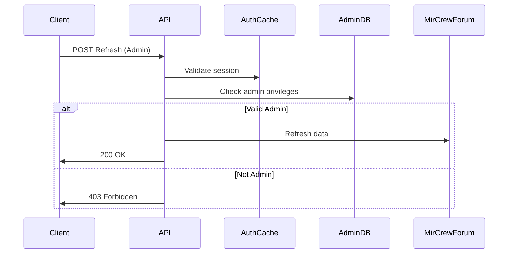
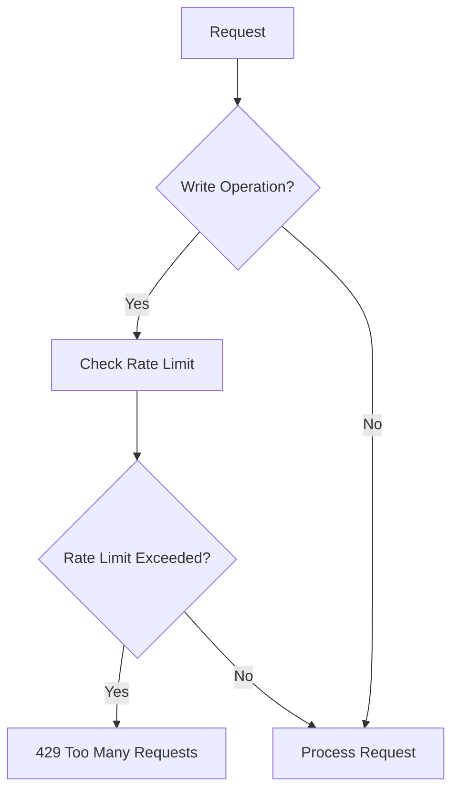

# MIRCrew Smart Indexer API Specification

## New Endpoints

### 1. GET /api/thread/{threadId}/status
**Purpose**: Check thread status and like information  
**Parameters**:
- `threadId` (path): Forum thread ID
- `userId` (query): Optional user ID for personalized status

**Response**:
```json
{
  "thread_id": "12345",
  "like_count": 42,
  "user_liked": true,
  "last_updated": "2025-09-25T12:00:00Z",
  "cached": true
}
```

### 2. POST /api/thread/{threadId}/like
**Purpose**: Like/unlike a thread  
**Authentication**: Required  
**Parameters**:
- `threadId` (path): Forum thread ID
- `action` (body): "like" or "unlike"

**Response**:
```json
{
  "thread_id": "12345",
  "new_status": "liked",
  "total_likes": 43
}
```

### 3. GET /api/thread/{threadId}/releases
**Purpose**: Get releases from specific thread  
**Parameters**:
- `threadId` (path): Forum thread ID
- `season` (query): Optional season filter
- `episode` (query): Optional episode filter

**Response**: Torznab-compatible XML

### 4. GET /api/liked-threads
**Purpose**: List user's liked threads  
**Authentication**: Required  
**Parameters**:
- `page` (query): Pagination (default 1)
- `limit` (query): Items per page (default 25)

**Response**:
```json
{
  "results": [
    {
      "thread_id": "12345",
      "title": "Show Name S01",
      "like_date": "2025-09-25T11:30:00Z",
      "release_count": 5
    }
  ],
  "pagination": {
    "total": 42,
    "page": 1,
    "pages": 2
  }
}
```

### 5. POST /api/search/refresh/{threadId}
**Purpose**: Refresh cached thread data  
**Authentication**: Required (Admin)  
**Response**:
```json
{
  "thread_id": "12345",
  "refreshed_at": "2025-09-25T12:05:00Z",
  "new_releases": 2
}
```

## Database Schema Changes

### New Tables

#### 1. thread_likes
| Column       | Type        | Description                     |
|--------------|-------------|---------------------------------|
| id           | BIGSERIAL   | Primary key                     |
| thread_id    | VARCHAR(32) | Forum thread ID                 |
| user_id      | VARCHAR(64) | MirCrew user ID                 |
| liked_at     | TIMESTAMPTZ | When like was added             |
| unliked_at   | TIMESTAMPTZ | When like was removed (nullable)|

#### 2. cached_threads
| Column       | Type        | Description                     |
|--------------|-------------|---------------------------------|
| thread_id    | VARCHAR(32) | Primary key                     |
| title        | TEXT        | Thread title                    |
| author       | VARCHAR(64) | Thread author                   |
| post_date    | TIMESTAMPTZ | Original post date              |
| last_update  | TIMESTAMPTZ | Last metadata refresh           |
| like_count   | INTEGER     | Current like count              |

#### 3. like_history
| Column       | Type        | Description                     |
|--------------|-------------|---------------------------------|
| id           | BIGSERIAL   | Primary key                     |
| thread_id    | VARCHAR(32) | Forum thread ID                 |
| user_id      | VARCHAR(64) | MirCrew user ID                 |
| action       | VARCHAR(16) | "like" or "unlike"              |
| performed_at | TIMESTAMPTZ | Action timestamp                |
| ip_address   | INET        | User IP address                 |

## Authentication Flows



## Caching Strategy

| Data Type         | TTL    | Invalidation Triggers           | Storage         |
|-------------------|--------|----------------------------------|-----------------|
| Thread Metadata   | 24h    | Manual refresh, new releases    | Redis/PostgreSQL|
| Like Counts       | 1h     | Like/unlike actions             | Redis           |
| User Like Status  | 15m    | User like/unlike actions        | Redis           |
| Search Results    | 30m    | New thread creation             | Redis           |

## Migration Plan
1. Phase 1: Add new tables with zero-downtime migrations
2. Phase 2: Dual-write to old and new systems
3. Phase 3: Backfill existing like data (if any)
4. Phase 4: Switch read traffic to new endpoints
5. Phase 5: Deprecate old search endpoints
## Database Schema Diagram


## Authentication Flow Details

### Read Operations


### Write Operations (Like/Unlike)


### Admin Operations


## CSRF Protection Mechanism
1. Client obtains CSRF token via GET /api/csrf-token (cached for 1 hour)
2. Token must be included in X-CSRF-Token header for write operations
3. Server validates token against session-bound cache entry
## Caching Implementation Details

### Cache Layers
1. **Edge Cache (CDN)**: Static assets, API responses with public data
2. **Application Cache (Redis)**: 
   - Session data (TTL: 6h)
   - CSRF tokens (TTL: 1h)
   - Rate limit counters (Sliding window)
3. **Database Cache (Materialized Views)**:
   - Aggregated like counts
   - Popular threads

### Rate Limiting


### Cache Warming Strategy
1. **On Like/Unlike**: Update Redis counters immediately
2. **Scheduled Jobs**:
   - Hourly: Refresh popular thread metadata
   - Daily: Warm CDN cache for top 1000 threads
3. **On Refresh Command**: Full cache rebuild for specified thread

### Cache Invalidation
| Event                | Action                                  |
|----------------------|-----------------------------------------|
| New like             | Invalidate user-specific cache entries  |
| Thread update        | Invalidate thread metadata cache        |
| Admin refresh        | Full cache flush for thread             |
| Schema migration     | Global cache flush                      |